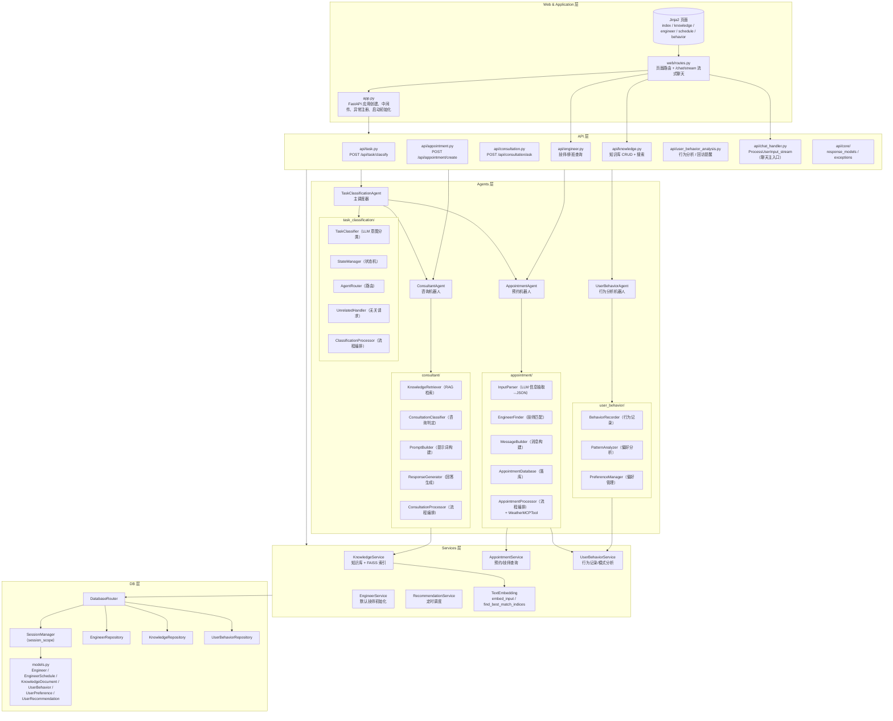
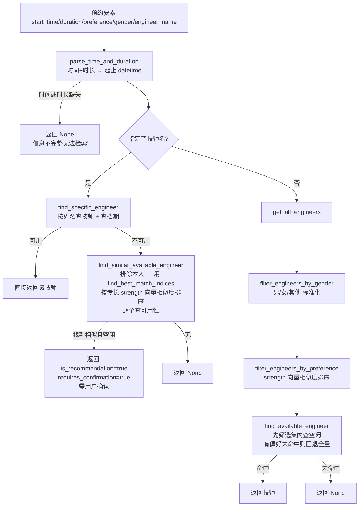
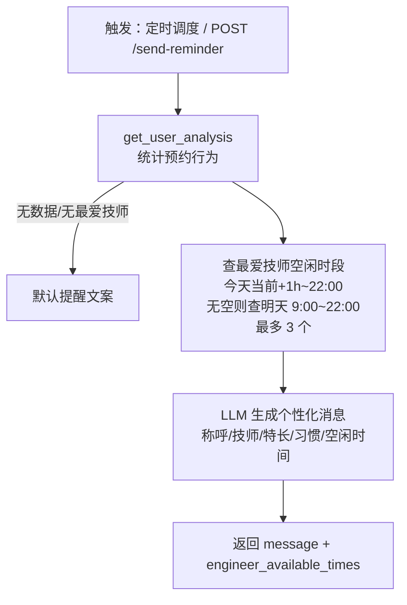
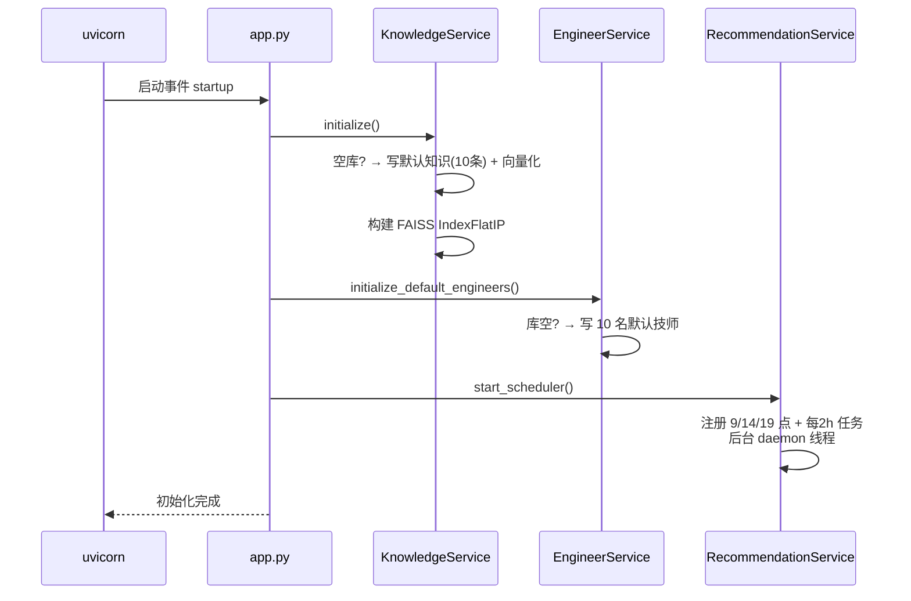
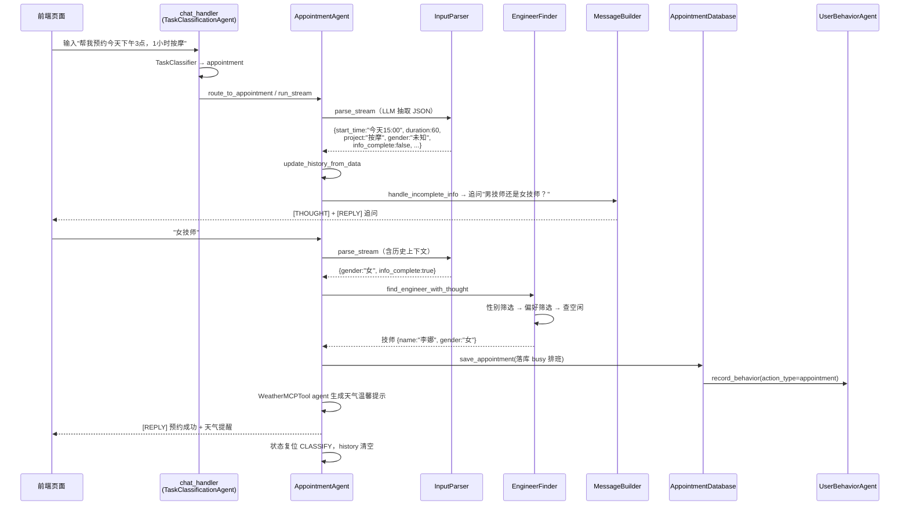
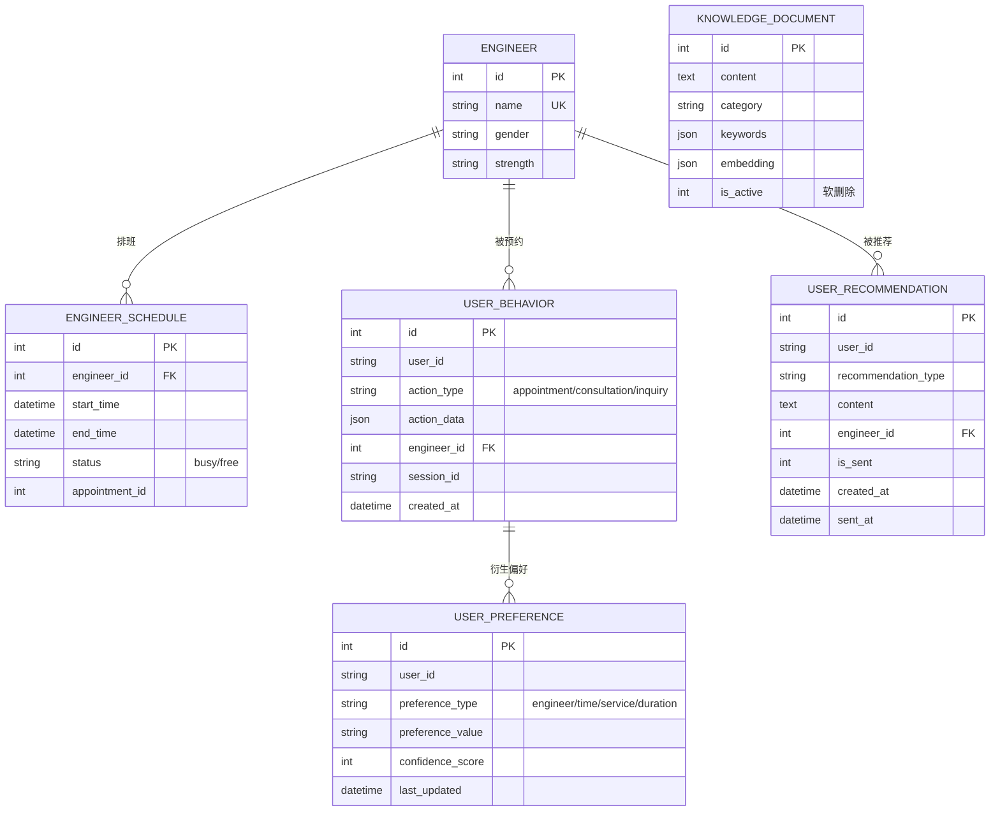

# Smart Appointment AI Agent 系统设计规格说明书（SPEC）

| 项目 | 内容 |
| --- | --- |
| 文档版本 | v1.0 |
| 编写日期 | 2026-08-31 |
| 适用版本 | 当前 master 分支（README 所述 2025 年开源版） |
| 系统名称 | Smart Appointment AI Agent（智能预约 AI 代理） |

---

## 1. 文档目的

本文档依据项目源码（`app.py`、`api/`、`agents/`、`services/`、`db/`、`config/`、`web/`）逐模块编写，用于：

- 完整描述系统的功能范围、架构分层与模块职责；
- 为开发者提供各模块的详细设计说明（输入、处理、输出、关键逻辑）；
- 提供框架级流程图（架构图、请求处理图、各 Agent 内部流程图、时序图、ER 图），作为实现与二次开发的依据。

---

## 2. 项目概述

### 2.1 项目目标

面向按摩门店场景，将前台高频工作自动化：理解用户是想**咨询**还是**预约**，判断服务偏好，匹配合适技师，检查可用时间，生成预约结果，并结合天气、历史行为与偏好数据给出个性化提醒与推荐。

### 2.2 核心能力清单

| 能力 | 说明 | 主要实现位置 |
| --- | --- | --- |
| 智能任务分类 | 识别用户意图（预约/查询/其他），路由到对应 Agent | `agents/task_classification/` |
| 多 Agent 协作 | 任务分类 Agent、咨询 Agent、预约 Agent、用户行为 Agent 分工 | `agents/` |
| RAG 知识咨询 | FAISS 向量检索 + LLM 生成，支持流式输出 | `agents/consultant/`、`services/knowledge_service.py` |
| 智能预约管理 | 解析预约需求、技师匹配、冲突推荐、确认与落库 | `agents/appointment/` |
| 用户行为分析 | 记录交互与预约行为，统计偏好，生成回访提醒 | `agents/user_behavior/`、`services/user_behavior_service.py` |
| 个性化提醒 | 预约成功后结合实时天气生成温馨提示 | `agents/appointment/appointment_processor.py`（WeatherMCPTool） |
| 向量检索匹配 | Embedding + FAISS 做知识检索与技师相似度匹配 | `services/text_embedding.py` |
| 数据管理 | 知识库/技师/用户行为数据 CRUD，数据变更后自动重建索引 | `services/knowledge_service.py`、`api/knowledge.py`、`api/engineer.py` |
| 定时推荐调度 | 每天定时（9:00 / 14:00 / 19:00）触发推荐生成任务 | `services/recommendation_service.py` |
| 兜底与降级 | 信息缺失追问、LLM 异常降级默认回复、解析失败重试 | 各 Agent 的 MessageBuilder / 异常分支 |

### 2.3 技术栈

- **后端框架**：FastAPI、Uvicorn
- **AI 框架**：LangChain（LangChain Expression Language、`create_openai_tools_agent`）
- **大模型接入**：`config/model_provider.py` 工厂模式，支持 Azure OpenAI 与 OpenAI 兼容格式（Qwen / DeepSeek / Zhipu / OpenAI）
- **向量检索**：FAISS（`IndexFlatIP` 内积相似度用于知识检索、`IndexFlatL2` 用于技师相似度）
- **数据库**：SQLite + SQLAlchemy（`declarative_base` 模型、`scoped_session`）
- **RAG**：Embedding 生成、向量索引、知识库检索、提示词构建
- **流式响应**：Python `AsyncGenerator` 逐 token 输出
- **前端**：Jinja2 模板 + 静态 CSS
- **外部服务扩展**：MCP 思路的天气工具（OpenWeatherMap API 可配置）
- **配置管理**：python-dotenv
- **后台任务**：schedule（线程中运行）
- **测试**：pytest

---

## 3. 系统总体架构

### 3.1 分层架构

项目采用严格五层架构，核心原则：**下层不能反向调用上层**。

```text
┌─────────────────────────────────────────────────────────┐
│  Web & Application Layer   web/  app.py                 │
│  页面渲染、路由入口、系统启动、流式聊天接入点              │
└─────────────────────────────────────────────────────────┘
                    ↓
┌─────────────────────────────────────────────────────────┐
│  API Layer            api/                              │
│  外部接口、请求编排、响应封装、异常转换                    │
└─────────────────────────────────────────────────────────┘
                    ↓
┌─────────────────────────────────────────────────────────┐
│  Agents Layer        agents/                            │
│  AI Agent、任务路由、对话流程控制（本层核心）             │
└─────────────────────────────────────────────────────────┘
                    ↓
┌─────────────────────────────────────────────────────────┐
│  Services Layer     services/                           │
│  业务逻辑、推荐算法、向量处理、数据库访问编排              │
└─────────────────────────────────────────────────────────┘
                    ↓
┌─────────────────────────────────────────────────────────┐
│  DB Layer           db/                                 │
│  SQLAlchemy 模型、Session 管理、Repository 数据访问      │
└─────────────────────────────────────────────────────────┘
```

### 3.2 调用规则

**允许的调用方向：**

- Web 层 → API 层
- API 层 → Agents 层 或 Services 层
- Agents 层 → Services 层
- Services 层 → DB 层

**禁止的调用方式：**

- 下层反向调用上层
- Web 层绕过 API 直接访问 Services 或 DB
- Agents 层绕过 Services 直接访问 DB
- Services 层调用 Agents、API 或 Web

> 注：源码中 `agents/user_behavior_agent.py` 等部分模块存在对 `db.EngineerDBRouter` 的直接访问，以及 `agents/appointment/engineer_finder.py` 延迟导入 Services，均以"懒加载 + 兼容层"方式尽量收敛到 Services；后续演进应统一经由 Services 层。

### 3.3 整体架构流程图



### 3.4 模块依赖关系要点

- `api/chat_handler.py` 创建全局单例 `TaskClassificationAgent(AppointmentAgent, ConsultantAgent)`，是整个聊天流程的唯一入口。
- 各 Agent 内部使用**组合**模式（Component 组装成 Processor），Processor 负责流程编排。
- Services 通过 `DatabaseRouter` 访问三个 Repository；`KnowledgeService` 额外管理 FAISS 索引。
- 懒加载（`@property` + 延迟 import）被广泛用于规避循环依赖（如 `AppointmentDatabase` → Services）。

---

## 4. 模块详细设计

### 4.1 Web 层（`web/`、`app.py`）

#### 4.1.1 `app.py`（应用入口）

| 项目 | 说明 |
| --- | --- |
| 职责 | 创建 FastAPI 应用、注册中间件/路由/异常处理器、启动时初始化系统 |
| 关键流程 | `create_app()` → CORS（`*`）→ 注册 `BusinessException` 与 `Exception` 处理器 → 注册 API 路由与 Web 路由 → 挂载 `/static` → 注册 `startup` 事件 |
| 启动初始化 | `initialize_system()`：① 初始化 `KnowledgeService`（建库 + 默认知识 + 向量索引）；② `EngineerService.initialize_default_engineers()`（写入 10 名默认技师）；③ 启动 `RecommendationService` 定时调度器 |

#### 4.1.2 `web/routes.py`（页面路由）

| 路由 | 方法 | 功能 |
| --- | --- | --- |
| `/` | GET | 渲染 `index.html`（聊天主页） |
| `/chat/stream`、`/chat` | POST | 调用 `ProcessUserInput_stream`，以 `StreamingResponse(text/plain)` 流式返回 |
| `/knowledge` | GET | 通过 API 层 `get_all_knowledge()` 获取数据后渲染知识库管理页 |
| `/engineer` | GET | 通过 API 层获取技师列表渲染技师状态页 |
| `/engineer_schedule` | GET | 通过 API 层获取今日排班渲染排班页 |
| `/user_behavior`、`/user_behavior_analysis` | GET | 渲染用户行为分析页 |
| `/admin`、`/admin/database` | GET | 渲染管理仪表板与数据库管理页（数据来自 API 层） |

**流式聊天端点行为**：`ChatRequest{message, state}` → `token_generator()` 逐 token `yield`，前端 SSE 式接收，令牌格式为带前缀标签的文本（`[THOUGHT]`、`[REPLY]`、`[SIGNAL]`、`[ERROR]`）。

#### 4.1.3 页面清单（`web/templates/`）

| 模板 | 用途 |
| --- | --- |
| `index.html` | 首页聊天与预约入口 |
| `knowledge_management.html` | 知识库管理（增删改查） |
| `engineer.html` | 技师信息管理 |
| `engineer_schedule.html` | 技师排班展示 |
| `user_behavior_analysis.html` | 用户行为分析展示 |

### 4.2 API 层（`api/`）

#### 4.2.1 路由总表

| 前缀 | 文件 | 主要端点 | 说明 |
| --- | --- | --- | --- |
| `/api/task` | `task.py` | `POST /classify` | 任务分类（返回分类结果） |
| `/api/appointment` | `appointment.py` | `POST /create` | 创建预约（简化实现） |
| `/api/consultation` | `consultation.py` | `POST /ask` | 提交咨询问题 |
| `/api/engineers` | `engineer.py` | `GET /`、`GET /{id}`、`GET /{id}/schedule`、`GET /schedules/today` | 技师信息与排班查询 |
| `/api/knowledge` | `knowledge.py` | `GET /`、`GET /{id}`、`POST /`、`PUT /{id}`、`DELETE /{id}`、`POST /search` | 知识库 CRUD 与向量搜索 |
| `/api/user-behavior`（及下划线别名） | `user_behavior_analysis.py` | `GET /analysis`、`GET /dashboard_data`、`POST /send-reminder` | 行为分析、仪表板、回访提醒 |

#### 4.2.2 `api/chat_handler.py`（聊天主入口，非 REST）

- 模块级创建全局 `session_id = uuid4()`（单用户场景）与 `TaskClassificationAgent` 单例。
- `ProcessUserInput_stream(user_input, state=None, context=None)`：`async for token in task_agent.classify_task_stream(user_input): yield token`，即所有聊天请求都先进**任务分类流程**。

#### 4.2.3 响应模型（`api/core/response_models.py`）

- `BaseResponse{message, timestamp}`、`DataResponse{message, timestamp, data}`
- 预约：`AppointmentRequest{user_id, service_type, preferred_time, notes}`、`AppointmentResponse{...}`
- 咨询：`ConsultationRequest{user_id, question, category}`、`ConsultationResponse{...}`
- 行为：`UserBehaviorRequest{user_id, action, context}`、`UserBehaviorResponse{...}`
- 分类：`TaskClassificationRequest{text, context}`、`TaskClassificationResponse{text, category, confidence, reasoning}`

#### 4.2.4 异常处理（`api/core/exceptions.py`）

- `BusinessException(HTTPException)` → 400，`api_exception_handler` 返回 `{error: detail}`。
- `general_exception_handler` → 500，记录堆栈并返回统一 `{error: "服务器内部错误"}`，避免泄露内部细节。

### 4.3 Agents 层（`agents/`）—— 系统核心

#### 4.3.1 TaskClassificationAgent（任务分类/主调度 Agent）

**职责**：分析用户输入 → 判断任务类型 → 路由到专业 Agent → 协调响应；维护对话状态；处理无关请求转交。

**组件装配**（`agents/task_classification_agent.py`）：

```text
TaskClassificationAgent
├── llm                      create_chat_model(temperature=0)
├── StateManager(SharedState)        状态机
├── TaskClassifier(llm)              LLM 意图分类
├── AgentRouter(appointment_agent, consultant_agent, state_manager)
├── UnrelatedHandler(state_manager)  无关请求回复（3 条轮换）
└── ClassificationProcessor(以上全部)  流程编排入口
```

**对外接口**：

| 方法 | 说明 |
| --- | --- |
| `classify_task(task)` | 同步/非流式处理（兼容旧接口） |
| `classify_task_stream(task)` | 流式处理主入口，`AsyncGenerator[str]` |
| `handle_unrelated(user_input)` / `handle_unrelated_async` | 各 Agent 转交的无关请求 → 重新走分类流程 |
| `get_classification_info()` | 当前状态与可用服务信息 |
| `reset_conversation()` | 重置状态与回复轮换 |
| `set_business_context(service_name)` | 定制无关回复的业务措辞 |

**回调机制**：`_setup_callbacks()` 将 `appointment_agent.unrelated_callback` 与 `consultant_agent.set_unrelated_callback` 绑定到本 Agent 的 `handle_unrelated*`，实现"子 Agent 无法处理 → 交回主调度器"的转交链路。

**子组件：**

| 组件 | 文件 | 职责 |
| --- | --- | --- |
| `TaskClassifier` | `task_classifier.py` | 用固定 PromptTemplate 驱动 LLM 输出类别：`appointment` / `query` / `pay` / `statistics` / `other`；非法输出与异常默认 `other` |
| `StateManager` | `state_manager.py` | 状态枚举：`CLASSIFY / APPOINTMENT / CONSULT / OTHER`；允许转换矩阵：CLASSIFY→{APPOINTMENT, CONSULT}，APPOINTMENT→CLASSIFY，CONSULT→CLASSIFY；提供 `should_classify / is_in_*_flow / transition_* / force_reset` |
| `AgentRouter` | `agent_router.py` | `route_to_appointment` / `route_to_consultation`：转换状态 → 输出 `[THOUGHT]` 转交提示 → 调用子 Agent 流式接口；异常时 `reset_to_classify`；`route_by_state` 用于持续对话状态 |
| `UnrelatedHandler` | `unrelated_handler.py` | 3 条轮换回复；`set_business_context` 可定制服务名；同步/异步两种处理 |
| `ClassificationProcessor` | `classification_processor.py` | 核心编排：`should_classify()` 则分类并路由，否则按当前状态继续；异常 → `[ERROR]` + `force_reset()` |

**任务分类流程图：**

```mermaid
flowchart TD
    A[用户输入 task] --> B{should_classify?}
    B -- 否（处于预约/咨询流程中）--> C[route_by_state<br/>按当前状态继续交给对应 Agent]
    B -- 是 --> D[TaskClassifier.classify_task<br/>LLM Prompt 分类]
    D --> E{分类结果}
    E -- appointment --> F[route_to_appointment<br/>state → APPOINTMENT]
    E -- query --> G[route_to_consultation<br/>state → CONSULT]
    E -- pay / statistics / other --> H[handle_unsupported_task<br/>'暂不支持该类型任务']
    F --> I[AppointmentAgent.run_stream]
    G --> J[ConsultantAgent.consult_stream]
    I --> K{子 Agent 识别为无关请求?}
    J --> K
    K -- 是 --> L[转交回调 handle_unrelated<br/>重新进入分类流程]
    K -- 否 --> M[流式返回 [THOUGHT]/[REPLY] 令牌]
    C --> M
    H --> M
    M --> N[前端逐 token 渲染]
```

#### 4.3.2 AppointmentAgent（预约 Agent）

**职责**：解析用户输入的预约要素 → 技师匹配（指定/自动）→ 检查可用性 → 冲突时推荐相似技师并等待确认 → 预约成功落库 + 天气温馨提示；信息缺失时追问。

**组件装配**（`agents/appointment_agent.py`）：

```text
AppointmentAgent
├── llm                        create_chat_model(temperature=0)
├── InputParser(llm)           信息抽取（流式 JSON 输出）
├── EngineerFinder()         技师匹配
├── MessageBuilder()           消息构建
├── AppointmentDatabase()      落库 + 行为记录
├── AppointmentProcessor(...)  流程编排（含 WeatherMCPTool agent）
├── chats_by_session_id        InMemoryChatMessageHistory 会话历史
└── appointment_history        当前轮预约要素缓存 {gender, start_time, duration,
                               project, preference, engineer, engineer_name}
```

**核心入口 `run_stream(user_input)` 流程：**

1. **解析输入**：`InputParser.parse_stream`（内部 JSON，不向用户流式暴露），再 `parse_data` 得到 JSON。
2. **无关请求判定**：`data.unrelated == true` 且不在等待推荐确认 → 状态置 `CLASSIFY`，转交 `unrelated_callback`（保留已填信息）。
3. **信息完整判定**：`update_history_from_data` 合并非"未知"字段，判断必需字段（详见 5.2 节规则）。
4. **分支处理**：
   - `finished == true` → `handle_complete_appointment`（技师匹配→推荐确认/成功落库），若产出 `[SIGNAL]recommendation_pending` 则保持流程继续；
   - 否则 → `handle_incomplete_info` 输出 `[THOUGHT]` + 追问问题。
5. **兜底**：任何异常 → `create_parse_error_message()`（"解析失败，请重试"）。

**子组件：**

| 组件 | 文件 | 职责与关键逻辑 |
| --- | --- | --- |
| `InputParser` | `input_parser.py` | Prompt 要求输出**纯 JSON**：`{gender, start_time, duration, project, preference, engineer_name, confirmation, info_complete, unrelated, missing_info}`；`start_time` 强制转 `YYYY-MM-DD HH:MM`（今天/明天语义化）；时长统一转分钟；判断"确认回复（是/好/可以/不）"优先识别为 `confirmation` 而非 `unrelated`；JSON 解析失败返回全"未知"+ `info_complete: false` 的降级结构；流式输出同时写入 `InMemoryChatMessageHistory` |
| `EngineerFinder` | `engineer_finder.py` | 见下方"技师匹配算法" |
| `MessageBuilder` | `message_builder.py` | 成功消息（区分推荐/非推荐）、推荐话术（LLM 生成、失败降级模板）、拒绝推荐回复、失败消息、缺失信息追问表（gender/start_time/duration/project/preference 各一句）、无关/解析失败/保存失败消息 |
| `AppointmentDatabase` | `appointment_database.py` | 通过 Services 保存预约；成功后 `_record_user_behavior` 写 `appointment` 行为；`update_memory_schedule` 更新内存 `busy_periods_dict` |
| `AppointmentProcessor` | `appointment_processor.py` | 流程编排；**WeatherMCPTool**：`get_current_weather`（OpenWeatherMap，无 API Key 时返回固定兜底文案），用 `create_openai_tools_agent` + `AgentExecutor` 生成"预约成功 + 天气温馨提示" |

**技师匹配算法（`EngineerFinder`）：**



**推荐确认状态机**（`appointment_history` 上的标志位）：

- `awaiting_confirmation: true` → 用户回复被解析为 `confirmation` 字段；
  - 肯定词（是/好/可以/同意/确定/yes/ok/行）→ `confirmed_engineer` 设置，继续完成预约；
  - 否定词（不/不要/不行/不同意/换/no）→ `recommendation_declined` 置位，输出理解类回复；
  - 模糊回复 → 再次询问"请您明确回复是或不"。

#### 4.3.3 ConsultantAgent（咨询 Agent / RAG 问答）

**职责**：判定是否咨询类问题 → RAG 检索知识库 → 构建提示词 → 流式回答 → 记录咨询行为。

**组件装配**（`agents/consultant_agent.py`）：`llm(temperature=0.3)` + `KnowledgeRetriever` + `ConsultationClassifier` + `ResponseGenerator` + `ConsultationProcessor`。

**核心入口 `consult_stream(user_input)` 流程：**

```mermaid
flowchart TD
    A[用户输入] --> B[ConsultationClassifier.is_consultation_related<br/>LLM 判定 YES/NO]
    B -- NO（预约/无关） --> C[handle_unrelated_request<br/>state → CLASSIFY<br/>yield 转交提示 → 回调主调度器]
    B -- YES --> D[KnowledgeRetriever.search_knowledge<br/>top_k=3 向量检索]
    D --> E[PromptBuilder.build_consultation_prompt<br/>系统提示 + 知识上下文 + 用户问题]
    E --> F[ResponseGenerator.generate_response_stream<br/>yield [REPLY][咨询机器人] + 逐字符]
    F --> G[记录咨询行为 consultation<br/>UserBehaviorAgent.record_behavior]
    G --> H[state → CLASSIFY 复位]
```

**子组件：**

| 组件 | 文件 | 职责与关键逻辑 |
| --- | --- | --- |
| `ConsultationClassifier` | `consultation_classifier.py` | Prompt 输出仅 `YES/NO`；咨询范围含：服务、价格、营业时间、技师情况、地址交通、联系方式等；异常时默认 `True`（避免误拒） |
| `KnowledgeRetriever` | `knowledge_retriever.py` | 懒初始化 `KnowledgeService`；`search_knowledge(query, top_k=3)`；打印检索日志（相关度/分类/内容摘要） |
| `PromptBuilder` | `prompt_builder.py` | 系统提示（推拿房前台接待员，知识缺失时给出地址/交通/致电兜底话术）；知识上下文格式化（无命中时提示基于专业知识的兜底回答） |
| `ResponseGenerator` | `response_generator.py` | 流式输出：先 `yield "[REPLY][咨询机器人]"` 再逐字符输出；异常返回友好错误 |
| `ConsultationProcessor` | `consultation_processor.py` | 编排检索→生成→行为记录；无关请求处理含"yield 转交提示 + 回调主调度器"两步 |

#### 4.3.4 UserBehaviorAgent（用户行为 Agent）

**职责**：记录行为（预约/咨询）、统计偏好（最喜技师/服务/时长）、判断回访时机、生成个性化提醒（LLM 生成 + 技师空闲时段）。

**组件装配**：`UserBehaviorService` + `PatternAnalyzer` + `BehaviorRecorder` + `PreferenceManager`（优先 Services 层，ImportError 时降级到 `DatabaseRouter` 兼容模式）。

**关键方法：**

| 方法 | 说明 |
| --- | --- |
| `record_behavior(action_type, action_data, engineer_id, session_id)` | 统一以 `user_id="default_user"` 记录（单用户场景）；异常先记录日志再走兼容回退 |
| `get_user_analysis(user_id)` | 调用 `PatternAnalyzer.analyze_user_preferences` 输出 `{favorite_engineer_id, favorite_service, favorite_duration, total_appointments, days_since_last_appointment, should_send_reminder}` |
| `generate_reminder_message` | 模板化回访消息（非 LLM 兜底） |
| `generate_personalized_reminder` | LLM 生成：结合最爱技师姓名/特长、常用服务/时长、空闲时段，80 字以内温暖话术；无偏好/异常时返回默认文案 |
| `get_reminder_with_schedule` | ① 获取分析 → ② 查最爱技师"今天（当前时间+1 小时起）→ 22 点"逐小时档期，无空时查明天 9–22 点（最多 3 个）→ ③ LLM 生成消息 |

**回访判断规则**（`PatternAnalyzer.should_send_return_reminder`）：总预约 ≥ 2 次 **且** 距上次预约 ≥ 30 天。

**用户行为提醒流程图：**



### 4.4 Services 层（`services/`）

#### 4.4.1 `KnowledgeService`（知识库服务）

| 项目 | 说明 |
| --- | --- |
| 职责 | 知识文档 CRUD、Embedding 生成、FAISS 索引构建与检索 |
| 初始化 | `initialize()`：空库则写入 10 条默认知识（营业时间/服务项目/技师信息/门店地址/服务介绍×3/服务质量/预约政策/会员服务）→ `_build_vector_index()` |
| 索引 | `faiss.IndexFlatIP`（内积相似度），`document_ids` 维护 id↔索引位映射；文档无 embedding 时自动补算并回写 |
| 检索 | `search(query, top_k=3, category=None)`：查询向量化 → 检索 `top_k*2` 候选 → 按分数排序截取 top_k，支持分类过滤 |
| 数据变更 | `add_document` / `update_document` / `delete_document` 成功后自动 `_build_vector_index()`（软删除 `is_active=0`） |
| 其他 | `search_by_category` / `search_by_keywords` / 分类与计数统计 |

#### 4.4.2 `AppointmentService`（预约服务）

| 方法 | 说明 |
| --- | --- |
| `save_appointment(engineer_id, start_time, end_time, history, session_id)` | 生成毫秒级 `appointment_id`，写入 `EngineerSchedule(status="busy")` |
| `get_engineer_by_id / get_engineer_by_name / get_all_engineers / get_engineers_by_gender` | 技师查询 |
| `get_engineer_schedules / is_engineer_available` | 排班与可用性（重叠 busy 段判定） |
| `add_engineer` / `get_all_strengths` | 技师新增与专长列表 |

#### 4.4.3 `EngineerService`（技师服务）

- 内置 **10 名默认技师**（张伟/王强/李娜/赵敏/刘洋/孙丽/周杰/吴婷/郑斌/何静），含性别与专长描述（其中两位专长相近，用于验证相似匹配）。
- `initialize_default_engineers()`：库空时写入，已存在则跳过。

#### 4.4.4 `RecommendationService`（推荐调度服务）

- 定时任务：每天 `09:00 / 14:00 / 19:00` + 每 2 小时（测试用），`schedule.run_pending()` 每分钟轮询，后台 daemon 线程运行。
- `generate_recommendations_job()`：当前为占位实现（返回 None），预留基于用户行为的推荐逻辑。
- 提供 `start_scheduler / stop_scheduler / run_immediate_check / get_status`。

#### 4.4.5 `UserBehaviorService`（用户行为服务）

- `record_behavior` / `get_user_behaviors` / 偏好读写。
- `analyze_user_patterns(user_id)`：30 天窗口行为模式分析 →
  - 预约频率分级：`very_frequent(<7天) / frequent(<14) / regular(<30) / occasional`；
  - 偏好技师（预约次数 >1 才返回）；
  - 时间偏好（`preferred_hour` + `preferred_weekday` + 分布）。

#### 4.4.6 `text_embedding.py`（向量工具）

| 函数 | 说明 |
| --- | --- |
| `embed_input(text)` | 经 `create_embedding_model()` 调用 Embedding API 生成向量 |
| `find_best_match_indices(text, candidates)` | 候选向量 `IndexFlatL2` 检索，返回按相似度降序的索引列表（用于技师专长匹配） |
| `save_engineer_embeddings / load_engineer_embeddings` | 本地 pkl 缓存（预留优化） |

### 4.5 DB 层（`db/`）

#### 4.5.1 数据模型（`db/models.py`）

| 表 | 关键字段 | 说明 |
| --- | --- | --- |
| `engineers` | id, name(unique), gender, strength | 技师档案 |
| `engineer_schedules` | id, engineer_id(FK), start_time, end_time, status(`busy/free`), appointment_id | 排班/预约占用 |
| `knowledge_documents` | id, content, category, keywords(JSON), embedding(JSON), created_at, updated_at, is_active | 知识文档（软删除） |
| `user_behaviors` | id, user_id, action_type(`appointment/consultation/inquiry`), action_data(JSON), engineer_id(FK), session_id, created_at | 行为日志 |
| `user_preferences` | id, user_id, preference_type(`engineer/time/service/duration`), preference_value, confidence_score, last_updated | 偏好（置信度=出现次数） |
| `user_recommendations` | id, user_id, recommendation_type, content, engineer_id(FK), is_sent, created_at, sent_at | 推荐记录 |

#### 4.5.2 Repository 设计

- 抽象接口（`db/base/interfaces.py`）：`BaseEngineerRepository`、`BaseScheduleRepository`、`BaseKnowledgeRepository`、`BaseUserBehaviorRepository`（ABC 定义方法契约）。
- 实现（`db/repositories/`）：
  - `EngineerRepository`：技师 CRUD + 排班管理 + `is_engineer_available`（时间段重叠查询 `start_time < end_time AND end_time > start_time` + `status == "busy"` 冲突判定）。
  - `KnowledgeRepository`：文档 CRUD（软删除）、分类/关键词/内容搜索、统计。
  - `UserBehaviorRepository`：行为记录查询、偏好累加（同值 `confidence_score+1`）、推荐记录、`get_user_statistics`（30 天行为数/预约数/咨询数/最爱技师/距上次到访天数）、`get_engineer_popularity`。
- 兼容层（`db/local_db.py`、`db/db_router.py` 末尾的 `*DBRouter` 类）：旧接口重定向到新 Repository，保留 DeprecationWarning。

#### 4.5.3 `SessionManager`（`db/base/session_manager.py`）

- `create_engine` + `Base.metadata.create_all` + `scoped_session`。
- `session_scope()` 上下文管理器：自动 commit / 异常 rollback / finally close。
- `DatabaseRouter` 统一持有 SessionManager 与三个 Repository（`engineers / knowledge / user_behavior` 属性访问）。

### 4.6 Config 层（`config/`）

| 文件 | 职责 |
| --- | --- |
| `constants.py` | `StateEnum(CLASSIFY/APPOINTMENT/CONSULT/OTHER)`、`SharedState`（value 初始 CLASSIFY）、全局 `busy_periods_dict` 内存忙碌时段 |
| `model_provider.py` | 工厂：`create_chat_model(temperature)`、`create_embedding_model()`；`MODEL_PROVIDER` 支持 `azure / openai / qwen / deepseek / zhipu / openai-compatible`；Azure 用 `AZURE_OPENAI_*` 系列变量，OpenAI 兼容用 `LLM_* / EMBEDDING_*` 系列变量；`check_embedding_ctx_length=False` 兼容 DashScope |
| `settings.py` | `AppSettings` 占位，预留 |
| `database.py` | `DatabaseConfig`：`DATABASE_URL`、`DB_ECHO`、连接池参数（SQLite 自动禁用连接池） |
| `time_config.py` | `TimeConfig`：统一**北京时间 UTC+8**；`now/today/current_date_str/parse_datetime/format_datetime`；`get_business_hours()` 返回 (12, 22) 与 `is_business_time()` |

> 注：`time_config.get_business_hours` 返回 12:00–22:00，而默认知识库写的是 9:00–22:00，`user_behavior_agent` 查档期用 9–22 点，三处口径需在业务上统一（见 8 节注意事项）。

### 4.7 外部服务与扩展

- **天气（MCP 思路）**：`WeatherMCPTool`（`agents/appointment/appointment_processor.py`）以 LangChain `BaseTool` 实现，OpenWeatherMap API；`OPENWEATHER_API_KEY` 缺失时返回固定兜底文案。
- **模型提供商切换**：修改 `.env` 的 `MODEL_PROVIDER / EMBEDDING_PROVIDER` 即可，无需改代码。
- **mcp-server/** 目录：预留 MCP 外部服务扩展位置（当前未启用）。

---

## 5. 核心流程设计

### 5.1 系统启动初始化流程



### 5.2 预约流程（详细时序）



### 5.3 咨询流程（RAG 数据流）

```mermaid
flowchart LR
    subgraph 输入
        Q[用户问题<br/>"肩颈推拿有什么效果？"]
    end
    subgraph 检索
        E1[embed_input 查询向量] --> F1[FAISS IndexFlatIP<br/>相似度 Top-k]
        F1 --> D1[(knowledge_documents<br/>SQLite + embedding JSON)]
    end
    subgraph 生成
        P[PromptBuilder<br/>系统提示+知识上下文+问题] --> L[LLM]
    end
    subgraph 输出
        O[流式回答]
        B[行为记录 consultation]
    end
    Q --> E1
    D1 --> P
    L --> O
    O --> B
```

### 5.4 对话令牌协议（前端解析约定）

流式响应为文本令牌流，前端需按前缀解析：

| 令牌前缀 | 含义 | 示例 |
| --- | --- | --- |
| `[THOUGHT][某某机器人]` | 思考过程/转交提示（可灰显） | `[THOUGHT][归类机器人] 归类机器人：我发现这是一个预约任务...` |
| `[REPLY][某某机器人]` | 正式回复正文（流式逐字符） | `[REPLY][预约机器人] 机器人：已为您预约...` |
| `[SIGNAL]recommendation_pending` | 内部信号：等待推荐确认 | 前端不展示 |
| `[ERROR]` | 错误提示 | `[ERROR]预约处理失败: ...` |

---

## 6. 异常处理与兜底机制汇总

| 场景 | 兜底行为 |
| --- | --- |
| 任务分类 LLM 失败/非法输出 | 归类为 `other`，提示"暂不支持该类型任务" |
| 输入解析 JSON 失败 | 返回全"未知"结构 + `info_complete=false`，继续追问流程 |
| 预约时间/时长解析失败 | 技师查找返回 None → 失败消息"该时间段没有合适的技师空闲" |
| 指定技师不存在/不空闲 | 相似技师推荐 → 用户拒绝则理解性回复 |
| LLM 生成推荐话术/提醒失败 | 降级为内置模板消息 |
| 天气 API 无 Key/调用失败 | 固定兜底天气文案 |
| 预约落库失败 | "预约保存失败，请重试" |
| 行为记录失败 | 仅打日志，不影响预约主流程 |
| 咨询生成异常 | 友好错误消息，分类异常默认按咨询处理 |
| 子 Agent 处理异常 | `[ERROR]` + 状态强制复位 CLASSIFY |
| API 层异常 | `BusinessException`→400；未知异常→500 统一 `{error}` 结构 |

---

## 7. 数据模型 ER 图



---

## 8. 已知注意事项（基于源码观察）

1. **营业时间口径不一致**：`time_config.get_business_hours()` 为 12:00–22:00；默认知识库文档与 `user_behavior_agent` 空闲档期查询按 9:00–22:00 处理，需统一。
2. **兼容层残留**：`agents/user_behavior/` 各组件与 `user_behavior_agent.py` 中保留 `behavior_db` / `EngineerDBRouter` 直接访问 DB 的兼容路径，新代码应统一走 Services。
3. **简化 API 与 Agent 接口对齐**：`api/appointment.py` 调用 `AppointmentAgent.process_appointment_request`、`api/consultation.py` 调用 `ConsultantAgent.process_consultation`，与当前 Agent 实际方法名（`run_stream` / `consult`）不一致，正式使用建议走 `/chat/stream` 或修正 API 层适配。
4. **单用户模型**：所有用户行为统一 `user_id="default_user"`，会话由全局 `session_id` 维护，多用户需引入会话/用户体系（README 后续规划已列）。
5. **`RecommendationService.generate_recommendations_job`** 为占位实现，定时任务框架已就绪但推荐生成逻辑待实现。
6. **`pay` / `statistics` 分类**：分类器可识别，但路由器不支持（返回"暂不支持"），属预留能力。

---

## 9. 测试设计（`tests/`）

| 文件 | 覆盖范围 |
| --- | --- |
| `test_task_classification_agent.py` | 意图分类、状态流转、路由、无关请求处理 |
| `test_appointment_agent.py` | 输入解析、信息补全、技师匹配、预约落库 |
| `test_consultant_agent.py` | 咨询判定、RAG 检索、回答生成 |
| `test_user_behavior_agent.py` | 行为记录、偏好统计、回访提醒判断 |

运行：`pytest`（全部）或 `pytest tests/xxx.py`（单个）。

---

## 10. 扩展方向（来自 README 后续规划）

1. **Agent 自主能力**：自我反思、多轮推理链、基于真实反馈优化推荐。
2. **多 Agent 协作增强**：Agent-to-Agent 直接通信、行为 Agent 定时主动触达、跨 Agent 上下文记忆打通。
3. **生产化**：登录/权限/数据隔离、完整异常与边界覆盖、检索性能与缓存优化、Docker 部署与云数据库。

---

*本文档由源码逐模块整理，若代码演进请同步更新对应章节。*
